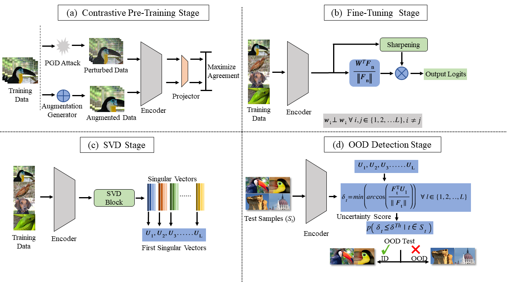

[](https://paperswithcode.com/sota/out-of-distribution-detection-on-cifar10?p=rodd-a-self-supervised-approach-for-robust)
# RODD Official Implementation of 2022 CVPRW Paper
## RODD: A Self-Supervised Approach for Robust Out-of-Distribution Detection
Introduction: 
Recent studies have addressed the concern of detecting and rejecting the out-of-distribution (OOD) samples as a major challenge in the safe deployment of deep learning (DL) models. It is desired that the DL model should only be confident about the in-distribution (ID) data which reinforces the driving principle of the OOD detection. In this work, we propose a simple yet effective generalized OOD detection method independent of out-of-distribution
datasets. Our approach relies on self-supervised feature learning of the training samples, where the embeddings lie on a compact low-dimensional space. Motivated by the recent studies that show self-supervised adversarial contrastive learning helps robustifying the model, we empirically show that a pre-trained model with selfsupervised contrastive learning yields a better model for uni-dimensional feature learning in the latent space. The method proposed in this work, referred to as RODD, outperforms SOTA detection performance on extensive suite of benchmark datasets on OOD detection tasks.

 Overall architecture of the proposed OOD detection method. (a) In the first step, self-supervised adversarial contrastive learning is performed.(b) Secondly, the encoder is fine-tuned by freezing the weights of the penultimate layer. (c) Thirdly, we calculate the first singular vectors of each class using their features. (d) The final step is the OOD detection where uncertainty score is estimated using cosine similarity between the feature vector of the test sample and first singular vectors of each ID class. <br />
## Dataset Preparation
### In-Distribution Datasets
CIFAR-10 and CIFAR-100 are in-distribution datasets which will be automatically downloaded during training
### OOD Datasets
Create a folder 'data' in the root 'RODD' folder<br />
Download following OOD datasets in the 'data' folder. <br />
[Places](http://pages.cs.wisc.edu/~huangrui/imagenet_ood_dataset/iNaturalist.tar.gz)<br />
[Textures (Download the entire dataset)](https://www.robots.ox.ac.uk/~vgg/data/dtd/)<br />
All other OOD Datasets such as ImageNetc, ImageNetr, LSUNr, LSUNc, iSUN and SVHN can be downloaded from [Google Drive](https://drive.google.com/drive/folders/1MLz5C3EjQbAd1M2yktviM0qENXg4jvfz?usp=sharing)
# Running the Code
## Tested on:

Python 3.9
cuda 11.2
torch 1.8.1
torchvision 0.9.1
numpy 1.20.1
sklearn 0.24.1
## **Pre-Training**
### For CIFAR-10:
```bash
python pretrain.py --dataset cifar10
```
### For CIFAR-100:
```bash
python pretrain.py --dataset cifar100
```
## **Fine-Tuning**
### For CIFAR-10:
```bash
python fine_tune.py --dataset cifar10
```
### For CIFAR-100:
```bash
python fine_tune.py --dataset cifar100
```
## **Evaluation**
### For CIFAR-10:
```bash
python extract_features.py in-dataset cifar10
```
```bash
python evaluate_original.py
```
### For CIFAR-100:
```bash
python extract_features.py in-dataset cifar100
```
```bash
python evaluate_original.py
```
## Citation
```bash
@misc{https://doi.org/10.48550/arxiv.2204.02553,
  doi = {10.48550/ARXIV.2204.02553},
  url = {https://arxiv.org/abs/2204.02553},
  author = {Khalid, Umar and Esmaeili, Ashkan and Karim, Nazmul and Rahnavard, Nazanin},
  keywords = {Computer Vision and Pattern Recognition (cs.CV), FOS: Computer and information sciences, FOS: Computer and information sciences},
  title = {RODD: A Self-Supervised Approach for Robust Out-of-Distribution Detection},
  publisher = {arXiv},
  year = {2022},
  copyright = {arXiv.org perpetual, non-exclusive license}
}
```
